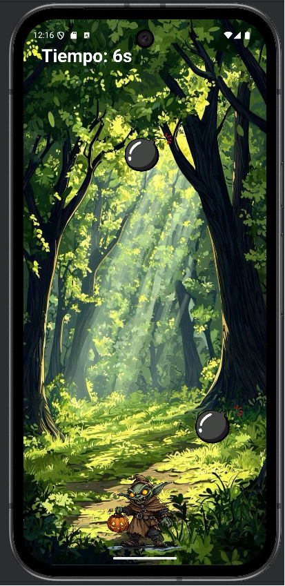
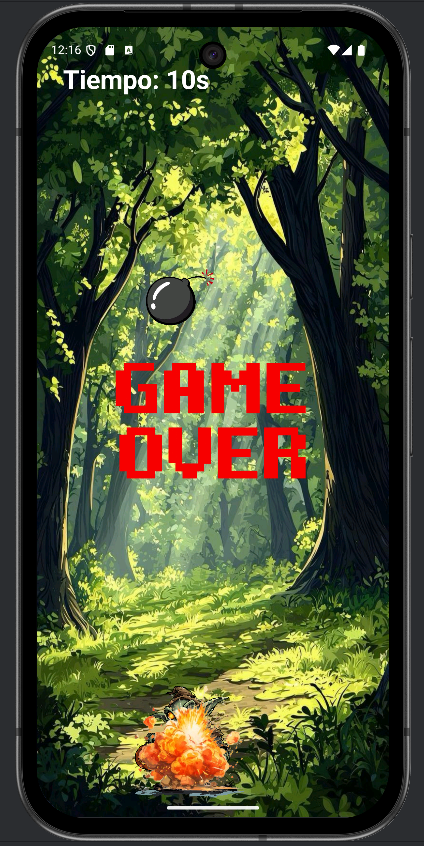

# GoblinGame

GoblinGame es un juego 2D para Android desarrollado en **Kotlin**.  
El jugador controla a un goblin situado en la parte inferior de la pantalla y se mueve de izquierda a derecha para evitar bombas que caen desde la parte superior a intervalos regulares. Cuando una bomba colisiona con el goblin, se muestra una explosión y la partida termina.

## Características

- Movimiento horizontal sencillo del personaje (sin saltos ni disparos).
- Bombas que aparecen periódicamente y caen verticalmente.
- Detección de colisiones entre goblin y bombas con animación de explosión.
- Pantalla de inicio con botón **Start Game** y pantalla de juego.
- Sistema de puntuación basado en tiempo de supervivencia.
- Aumento progresivo de dificultad incrementando velocidad y frecuencia de bombas.
- Música de fondo en bucle y efecto de sonido de explosión.

## Tecnologías

- **Lenguaje y plataforma**
    - **Kotlin**.
    - **Android SDK** (Android Studio).

- **Gráficos 2D**
    - `SurfaceView` y `SurfaceHolder.Callback` como lienzo dedicado al juego.
    - `Canvas`, `Bitmap` y `Paint` para dibujar fondo, goblin, bombas, HUD y explosión en cada frame.
    - Modelo de sprites separado en clases (`Goblin`, `Bomb`, `Explosion`).

- **Lógica de juego y bucle principal**
    - Clase `GameView` como vista principal del juego.
    - Clase `GameThread` (derivada de `Thread`) que ejecuta el bucle:
        - `update()` para lógica (movimiento, generación de bombas, colisiones, dificultad).
        - `draw(canvas)` para redibujar toda la escena.

- **Entrada de usuario**
    - Manejo de toques con `MotionEvent` y `onTouchEvent()`.
    - Movimiento del goblin según la posición horizontal del toque (izquierda/derecha).

- **Sonido**
    - `MediaPlayer` para la música de fondo en bucle.
    - `SoundPool` para efectos de sonido de baja latencia (explosión).
    - Clase `SoundManager` para:
        - `startMusic()`, `pauseMusic()`, `stopAndRelease()`.
        - `playExplosion()` al producirse la colisión bomba–goblin.

- **Colisiones y tiempo**
    - Detección de colisiones mediante rectángulos (`RectF.intersects`) entre goblin y bombas.
    - Clase `SurvivalTimer`:
        - `start()` guarda el instante inicial con `System.nanoTime()`.
        - `update()` calcula segundos transcurridos y los expone como puntuación.
        - El tiempo de supervivencia se usa también para escalar dificultad (velocidad de bombas).

- **Recursos**
    - `res/drawable`: sprites del goblin, bombas, explosión, fondo del bosque, imágenes de Game Over, formas de botones.
    - `res/raw`: música de fondo (MP3) y sonido de explosión (WAV).
    - `res/layout`: pantallas XML (especialmente `activity_main.xml` para el menú principal).

## Gameflow

1. **Inicio – Menú principal**
    - La app arranca en `MainActivity` (intent con `MAIN` + `LAUNCHER`).
    - Se muestra el fondo del bosque y los botones **Start Game** y **Exit**.
    - El jugador pulsa **Start Game**:
        - Se crea un `Intent` explícito hacia `GameActivity`.
        - Comienza la partida.
    - Si pulsa **Exit**, la actividad se cierra y se sale de la app.

2. **Juego en marcha**
    - `GameActivity` crea `GameView` y la establece como contenido.
    - `GameView` arranca el `GameThread` y comienza el bucle:
        - `update()`:
            - Mueve goblin y bombas.
            - Genera nuevas bombas y ajusta velocidad/dificultad.
            - Actualiza el `SurvivalTimer`.
            - Comprueba colisiones goblin–bomba.
        - `draw(canvas)`:
            - Dibuja fondo, bombas, goblin, explosión (si la hay) y HUD.
    - El jugador controla el goblin con toques a izquierda/derecha.

3. **Colisión y Game Over**
    - Cuando una bomba intersecta con el rectángulo del goblin:
        - Se marca `isGameOver`.
        - Se desactiva la bomba.
        - Se lanza la animación de explosión en la posición del goblin.
        - Se reproduce el sonido de explosión.
        - Se congela la lógica de movimiento, manteniendo la escena visible.
    - En pantalla se sigue mostrando el último valor de tiempo de supervivencia.

4. **Fin de partida y regreso al menú**
    - Tras unos instantes en estado de “Game Over” o tras una interacción (por ejemplo, un toque extra):
        - `GameActivity` vuelve a `MainActivity` (finalizando la activity o lanzando un nuevo intent).
    - El menú se muestra de nuevo, con el juego listo para otra partida.

## Capturas de pantalla

